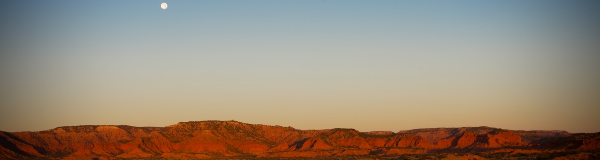

Caprock Canyon, Quitaque, TX

# Hello!

I'm **Chris Krough**, `ckrough` on the socials.

## `$ whoami`

**Engineering Leader** shaping engineering orgs, development workflows, and platform architectures 
**Animal Advocate** fostering, training, and walking rescue dogs (and tending to cats) 
**Fueled by** optimizing complex systems (people or tech) and the occasional mass migration

**Some things I've done:**
- Refactored engineering platforms to improve developer experience, reliability, and security.
- Migrated hundreds of services across half a dozen cloud environments with zero downtime
- Scaled a platform through >6,000% revenue growth and $3B in transactions
- Built telemetry across hundreds of Kubernetes clusters on multiple continents

**Career**
- **RBCx**: Led platform through acquisitions; 200 services migrated, 99.99% uptime maintained
- **OJO Labs**: Scaled infrastructure through 6,700% revenue growth and $3B in transactions
- **Amazon**: EKS beta tester; built telemetry across 150+ K8s clusters on three continents
- **uStudio**: Transformed engineering org into full-stack DevOps culture
- **Bazaarvoice**: 50K req/sec, 30B monthly pageviews; datacenter-to-cloud migration
- **Rackspace**: Global network ops across 10 data centers, 1M+ metrics/sec
- **Penn Vet (New Bolton Center)**: Veterinary medical systems; built the data center, ran the networks

## `$ cat ~/.skills`

**Workflow:** Agentic Development · Agent Skills · Context Engineering 
**AI/ML:** RAG Systems · LangChain · Prompt Engineering · Deep Learning 
**Languages:** Python · Go · Bash 
**Platforms:** Kubernetes · Docker · AWS 
**Domains:** Developer Experience · Platform Engineering · Reliability · Security

## `$ ls projects/`

- [**Drover**](https://github.com/ckrough/drover): AI application for knowledge classification and organization
- [**Retriever**](https://github.com/ckrough/retriever): RAG-powered Q&A system for organizational documents with source citations
- [**Workspaces**](https://github.com/ckrough/workspaces): Utilities for parallel agentic development using worktrees and venvs
- [**Team of Rivals**](https://github.com/ckrough/team-of-rivals): Strategic decisions via Claude AI Skills
- [**AWS Glacier Cleaner**](https://github.com/ckrough/aws-glacier-cleaner): Because deleting Glacier vaults shouldn't be painful

## `$ cat current_focus.txt`

Working through the [Deep Learning Specialization](https://www.coursera.org/specializations/deep-learning) (Andrew Ng) learning neural nets, CNNs, sequence models, Transformers. Building AI apps with PyTorch, TensorFlow, and LangChain.

## `$ git log --oneline aws/`

Contributions from my Amazon days:
- [AWS Service Operator](https://github.com/amazon-archives/aws-service-operator) Kubernetes CRDs for AWS
- [AWS VPN Controller](https://github.com/awslabs/aws-vpn-controller) K8s controller for VPN management
- [AWS EKS Cluster Controller](https://github.com/awslabs/aws-eks-cluster-controller) Multi-cluster EKS management

## `$ cat /etc/hobbies`

- Volunteering with [Friends of Homeless Animals](https://www.foha.org/) dog rescue & adoption
- Former telescope wrangler at the [Austin Astronomical Society](https://austinastro.org)
- Outdoor and nature photography

## `$ echo $OPEN_TO`

**AI Transformation Consulting** — Helping small businesses without tech teams adopt agentic AI solutions. I interview stakeholders, assess workflows, build custom tools, and provide ongoing hosting and vendor support. From "we use spreadsheets" to "AI handles that now."

**Fractional Engineering Leadership** — Part-time platform engineering, infrastructure, and security leadership for growing teams. I've scaled platforms through 6,000% growth; I can help you build the foundation for yours.

## `$ ping`

[LinkedIn](https://www.linkedin.com/in/ckrough/) · [dev@krough.org](mailto:dev@krough.org) · [ckrough.github.io](https://ckrough.github.io)