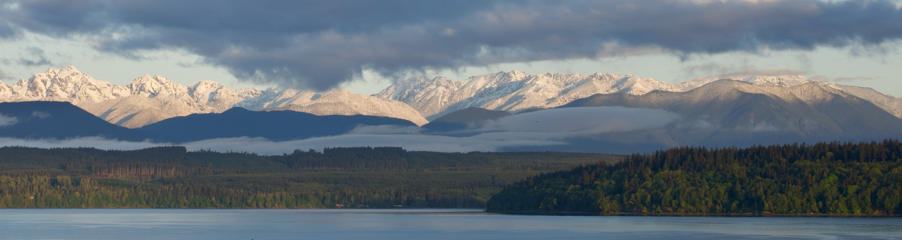

Caprock Canyon, Quitaque, TX

# Chris Krough

Engineering leader with 25+ years building platforms, scaling teams, and migrating things.

## What I've Built

- Platforms that scaled through >6,000% revenue growth and $3B in transactions
- Telemetry systems across hundreds of Kubernetes clusters on multiple continents
- Migration initiatives that moved hundreds of services across cloud environments with zero downtime
- Custom Kubernetes controllers for fleet management at Amazon scale

## Where I've Been

**[RBCx](https://www.rbcx.com)** · Led platform through acquisitions; 100s of services migrated, >99.999% uptime 
**[OJO Labs](https://www.ojo.com)** · Scaled platform through 6,700% revenue growth and $3B in transactions 
**[Amazon](https://aws.amazon.com/)** · AWS Labs, EKS beta tester; automated 150+ K8s clusters over three continents 
**[uStudio](https://ustudio.com)** · Transformed engineering org into full-stack devops culture 
**[Bazaarvoice](https://www.bazaarvoice.com)** · 50K req/sec, 30B monthly pageviews; datacenter-to-cloud migration 
**[Rackspace](https://www.rackspace.com)** · Global network ops across 10 data centers, 1M+ metrics/sec

## Current Work

Building AI tooling and diving deep on LLM evaluation frameworks. Working through Andrew Ng's [Deep Learning Specialization](https://www.coursera.org/specializations/deep-learning).

**Projects:**
- [retriever](https://github.com/ckrough/retriever) — RAG-powered Q&A with source citations and answer verification
- [drover](https://github.com/ckrough/drover) — AI document classification using LLMs
- [team-of-rivals](https://github.com/ckrough/team-of-rivals) — Strategic decisions via Claude AI Skills
- **agentspaces** — Agentic development environment with isolated worktrees, dependency management, and CI integration (private)

## Open Source from Amazon Days

- [AWS Service Operator](https://github.com/amazon-archives/aws-service-operator) — Kubernetes CRDs for AWS
- [AWS VPN Controller](https://github.com/awslabs/aws-vpn-controller) — K8s controller for VPN management
- [AWS EKS Cluster Controller](https://github.com/awslabs/aws-eks-cluster-controller) — Multi-cluster EKS management

## Stack

**AI/ML:** RAG · Agentic Workflows · Prompt Engineering · Deep Learning 
**Languages:** Python · Go · Bash 
**Platforms:** Kubernetes · Docker · AWS 
**Domains:** Platform Engineering · Developer Experience · Reliability

---

[LinkedIn](https://www.linkedin.com/in/ckrough/) · [dev@krough.org](mailto:dev@krough.org) · [dev.krough.org](https://dev.krough.org)
